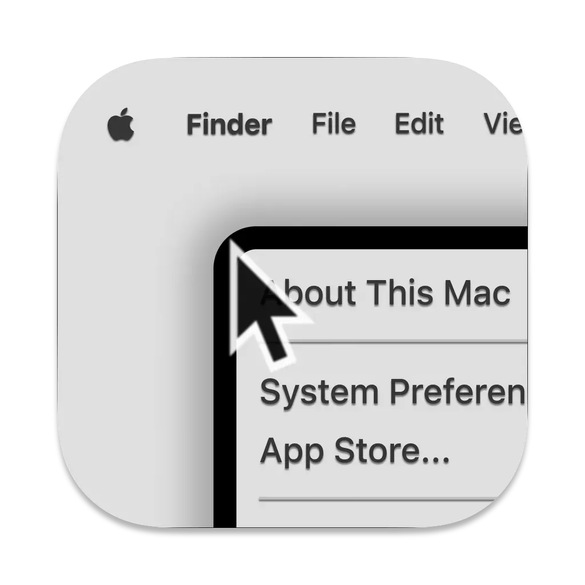
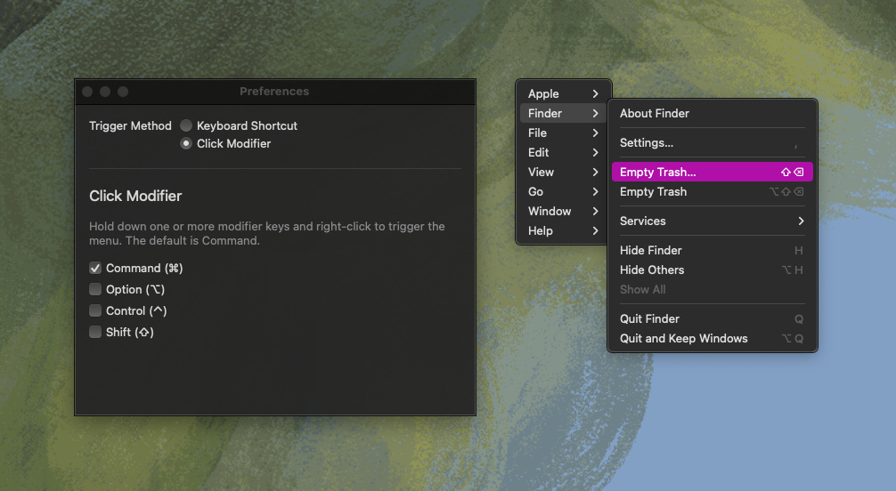
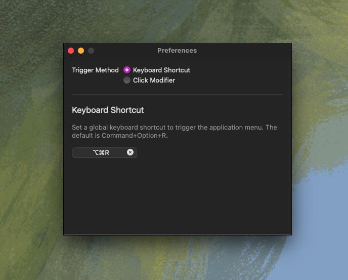

<p align="center">
  
</p>

# Right Click Menubar

OSX Menubar App that places the current application's menu bar in a context menu, triggered by a keyboard shortcut or modifier(s)+right click.



## Install

### Install with Brew

```bash
brew install --cask zimengxiong/tools/rightclickmenubar
```

### Releases

1. Download the latest from [Releases](https://github.com/ZimengXiong/right-click-menubar/releases)
2. Move to `/Applications`
3. Clear Gatekeeper warnings:

```bash
xattr -dr com.apple.quarantine /Applications/RightClickMenubar.app
```

### Build with XCode 16.3

Open and build like a normal XCode project.

## Settings



